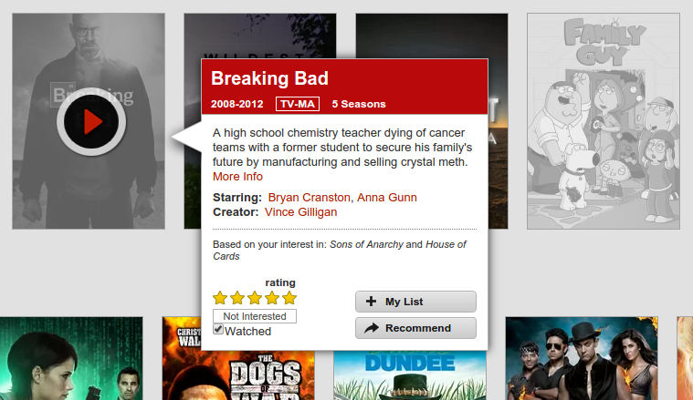

new-filtered-netflix
====================

Netflix does not visually distinguish movies that you have watched. The purpose of this ``user.js`` script is to track which movies you have watched and then grayscale the movie's picture. This will make it easier, at a glance, to know which movies you *might* be interested in watching.

Tracked movies are stored locally on your computer using ``localStorage``. Initially, no movies are tracked and so the cover of the movie will appear as normal. When hovering over a movie's picture, there is a "Watched" checkbox that appears in the popup. Clicking that checkbox will mark the movie as watched and its status will be tracked from that point forward. If an untracked movie has a rating, then it will be marked as watched the first time you hover over it. If you assign a rating to an untracked movie, then it will be marked as watched as well. The checkbox may be used to modify any tracked movie's watched status, independent of any rating it might have.

If you delete the browser cache, then the list tracked movies will be cleared, and you will need to redeclare which movies are "watched". Using multiple Netflix profiles is not yet supported---the tracked list of movies will affect whichever profile is in use.

This script replaces an older Netflix user script, and it has only been tested with TamperMonkey (e.g. for Chrome).

